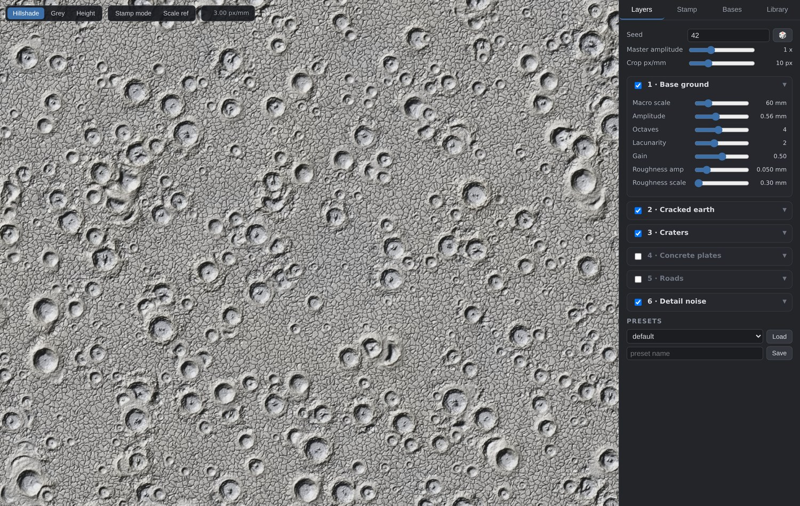
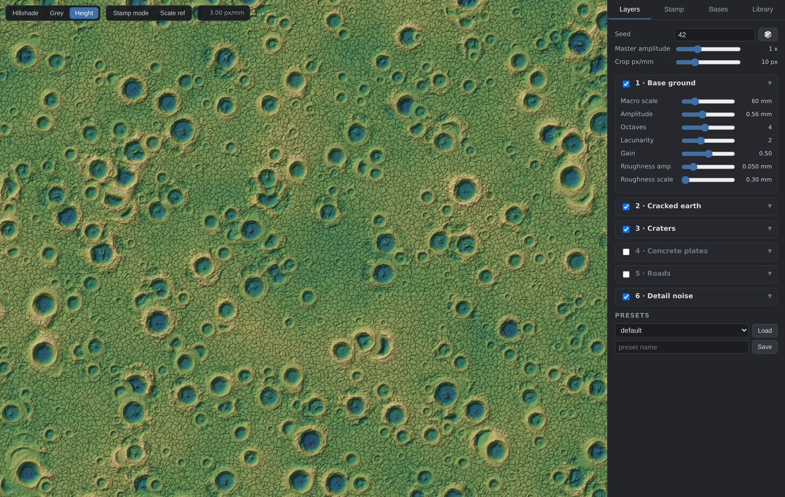
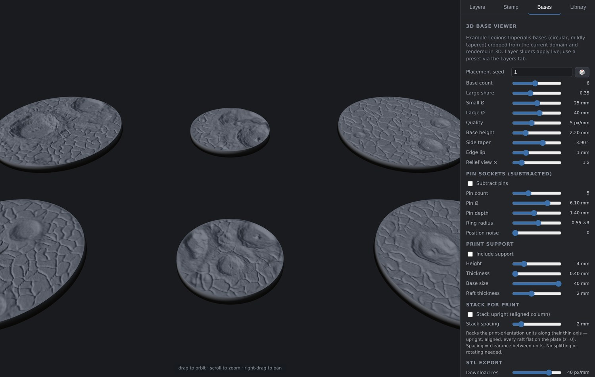
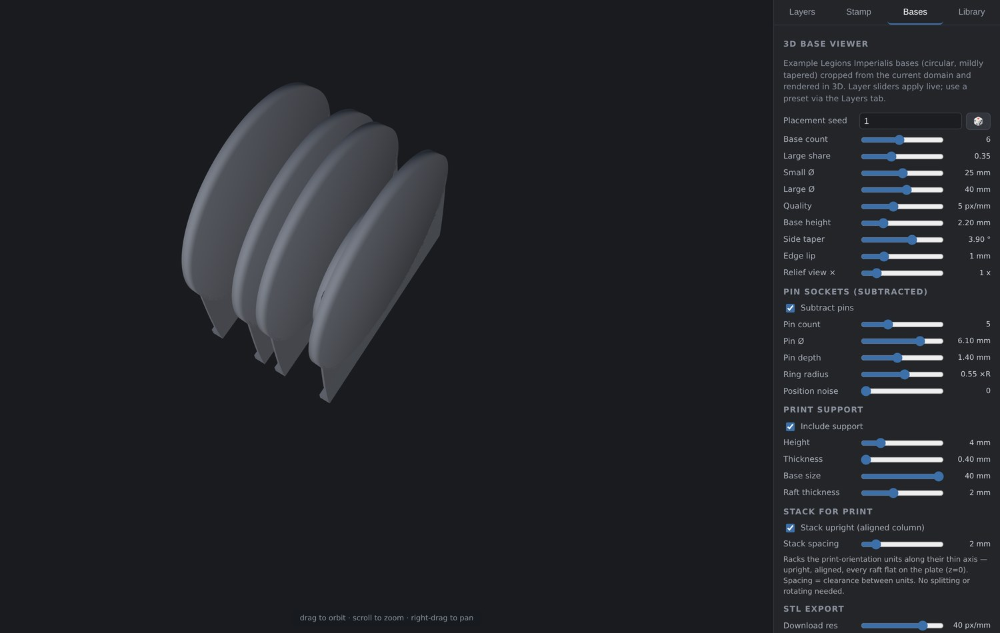
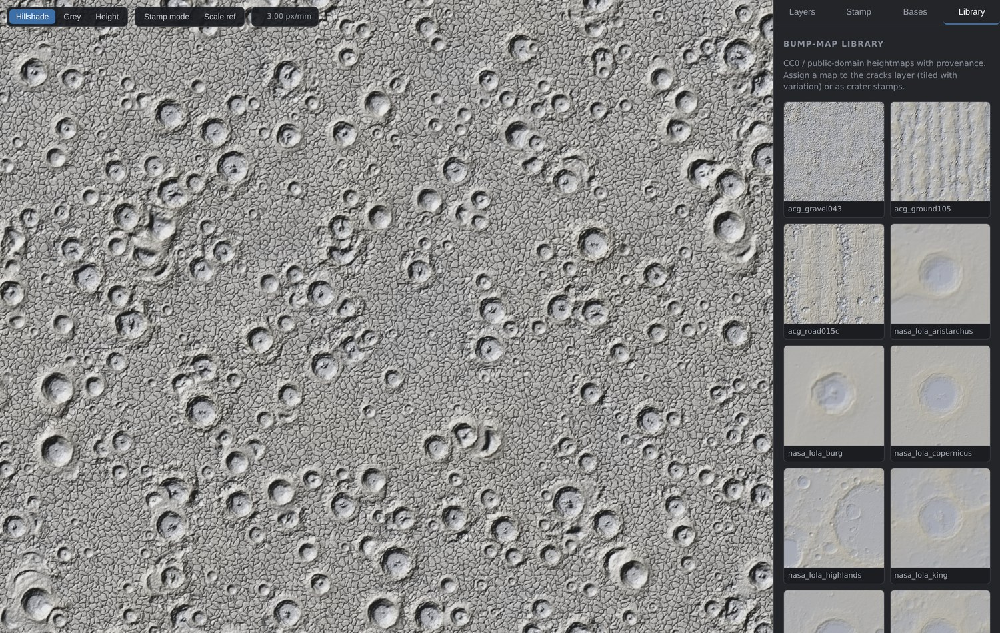

> [!NOTE]
> **🤖 All coded with LLMs.** Every line of this project — generator, server,
> viewer, STL pipeline — was written by large language models, driven through
> conversational iteration.

# Battlefield Heightmap Studio

**Procedural battlefield terrain for tabletop bases — from seeded noise to
print-ready STL.**

One large, continuous, **seeded and deterministic** terrain domain; an
interactive web viewer for tuning it; a CC0/public-domain bump-map library
for sourced texture data; and a 3D base pipeline that exports watertight,
print-oriented STLs for resin printing. Built for Legions Imperialis
(8&nbsp;mm) resin-printed bases, useful anywhere you want tiny, crisp,
reproducible terrain.



All spatial parameters are **millimeters**; heights are mm of physical
relief (defaults target ~0.3–0.8 mm on a 25 mm base next to 2 mm infantry).

---

## Highlights

- **Deterministic & seamless** — same seed + config + coordinates → bit-identical
  arrays, across processes and sessions. Every layer is a pure function of
  world coordinates and hashed integer lattices; there is no RNG state.
  Adjacent tiles are bit-exact sub-windows of any larger render.
- **Unbounded domain** — nothing is precomputed; render any region at any
  resolution on demand.
- **Real lunar craters** — impacts stamp actual NASA LOLA DEMs (Tycho,
  Copernicus, Theophilus, King, Aristarchus, Bürg) extracted from LDEM_64
  via HTTP range requests.
- **Sourced textures with provenance** — every library entry records source
  URL, license, author and the exact normalization applied. CC0 / public
  domain only, by policy.
- **Print-ready output** — one binary STL: mm units, Z-up, watertight
  shells, pin sockets, snap-off supports, and a stack-for-print rack mode
  that drops straight onto the build plate.
- **High-res export decoupled from the viewer** — orbit a light preview
  mesh, download at up to 50 px/mm (20 µm/px) regardless.

---

## Setup & run

```bash
python3 -m venv .venv
.venv/bin/pip install numpy scipy pillow fastapi "uvicorn[standard]" pytest
.venv/bin/uvicorn server.app:app --host 0.0.0.0 --port 8000
# open http://<host>:8000/
```

CLI test render (no server needed):

```bash
.venv/bin/python -m battlefield.cli --seed 42 --w 256 --h 256 --ppm 3 -o test.png
.venv/bin/python -m battlefield.cli --preset presets/sourced_battlefield.json -o test.png
```

Tests:

```bash
.venv/bin/python -m pytest tests/
```

Populate the bump-map library (downloads CC0 / public-domain sources,
writes provenance metadata):

```bash
.venv/bin/python scripts/source_maps.py       # texture tiles + LOLA DEM patches
.venv/bin/python scripts/source_lunar_craters.py   # crater stamp pool (LDEM_64)
```

---

## The web viewer

Infinite pan/zoom over slippy tiles (256 px, zoom 0–12; at zoom *z* a tile
covers 4096/2^z mm). Tiles are cached on (config hash, mode, z, x, y);
hillshade is computed with a 2 px apron so lighting seams never show.

| | |
|---|---|
| **Shading modes** | Hillshade / Grey / Height (false-color) |
| **Live tuning** | sliders for every layer parameter + seed, master amplitude; visible tiles re-render live (debounced ~300 ms) |
| **Stamp preview** | click the map → enlarged crop of a base-sized rectangle with height histogram, min/max/mean/relief stats, 16-bit heightmap download |
| **Scale ref** | overlay of a 25 × 12.5 mm base outline + 2 mm figure |
| **Presets** | save/load JSON on disk (`presets/`) |

False-color height mode, craters + cracked earth on the default preset:



---

## 3D bases → print

The **Bases** tab renders example bases — circular, mildly tapered frustums —
cropped from the current domain at seeded positions/rotations, in an
orbitable three.js view (vendored locally, no CDN). Layer sliders and
presets apply live. Backed by `POST /api/bases`, which returns the raw crop
grids the STL pipeline consumes.



Base geometry (defaults tuned for Legions Imperialis):

- **Sizes** — Ø25 mm small / Ø40 mm large, 2.2 mm slab.
- **Fixed-angle taper** — the side wall leans a set angle from vertical
  (default 3.9°: a 25 mm base tops out at 24.7 mm), so every size shares
  one wall angle.
- **Edge lip** — the bump map fades to zero over the last N mm before the
  rim; the outer edge stays a crisp flat circle regardless of terrain.
- **Pin sockets (subtracted)** — N flat-floored holes on an equidistant
  polar ring (default 5 × Ø6.1 × 1.4 mm deep), with a seeded position-noise
  dial (0 = perfect ring, 1 = up to 1 mm XY error per pin).
- **Print support** — optional thin snap-off tab (0.4 mm) flush with the
  base's bottom face: a crescent whose weld line hugs a full 180° of the
  rim, sweeping to a straight line on the build plate with a thicker raft
  foot (2 mm tall × base width, centered on the disc's mid-thickness).
  With supports on, the STL exports in print orientation — discs on edge,
  rafts at z=0.
- **Stack for print** — racks the print-orientation units along their thin
  axis like plates in a rack: upright, center-aligned, **every raft flat on
  the plate**, controllable clearance. Import the STL and print — no
  splitting, aligning or rotating in the slicer.



- **Base configs** — save/load the whole setup (base options, pins,
  support, placement seed) with the terrain preset embedded
  (`presets/bases/*.json`).
- **Export STL** — all displayed bases (+ supports) as one binary STL: mm
  units, Z-up, watertight shells, relief at true 1× regardless of the view
  exaggeration.

### High-res export

Viewer quality and download quality are independent: the on-screen mesh
stays light for smooth orbiting, and **Export STL** re-renders every base
at the chosen **Download res** at export time. A live estimate shows
µm/px, triangle count and file size before you commit.

| Download res | XY pitch | When to use |
|---|---|---|
| 20–25 px/mm | 50–40 µm | matches typical resin LCD XY pixels — full sets |
| 40 px/mm (default) | 25 µm | maximum Z-relief fidelity — export 1–2 bases at a time |
| 50 px/mm | 20 µm | overkill, but available |

---

## Generator API (what the STL pipeline uses)

```python
from battlefield import Domain, Library, load_preset

config, seed = load_preset("presets/nice looking v2.json")
dom = Domain(config, seed, library=Library("library"))

# any region on demand — the domain is unbounded, nothing is precomputed
h = dom.render_region(x=0, y=0, w_mm=512, h_mm=512, px_per_mm=4)

# a base crop: (x, y) = crop CENTER, rotation in degrees, mm heights out
crop = dom.crop(x=120.0, y=-45.0, w_mm=25.0, h_mm=12.5,
                rotation=33.7, px_per_mm=10)
```

Guarantees (all covered by `tests/test_generator.py`):

- **Deterministic** — same seed + config + coordinates → bit-identical
  arrays, across processes and sessions.
- **Seamless** — adjacent regions/tiles are bit-exact sub-windows of any
  larger render (feature spawning never depends on the query window).
- **Exact rotation** — `crop()` evaluates the field at rotated sample
  coordinates directly, no resampling. 90° crops equal `np.rot90` of the
  unrotated crop.

Config is a plain JSON dict (see `battlefield/config.py` for the full
schema + defaults); presets on disk are `{"seed": ..., "config": ...}`.

---

## Terrain layers

1. **Base ground** — fBm macro undulation + fine roughness.
2. **Cracked earth** — domain-warped Worley cell edges carved as negative
   displacement (cell size / width / depth / falloff), *or* a sourced
   cracked-earth map tiled with variation (mirror tiling + rotated second
   sample blended by low-frequency noise). Blend: add / min.
3. **Craters** — seeded spawn cells; by default each crater stamps a real
   lunar DEM from a **pool** (Tycho, Copernicus, Theophilus, King,
   Aristarchus, Bürg — NASA LOLA LDEM_64, 473 m/px, longitude stretch
   corrected). Bowl depth and rim height scale independently (real lunar
   rim/depth ratios read too weak at miniature scale). Impacts wipe the
   crack layer inside bowl+rim (`crack_clearing`). Analytic profile
   (parabolic bowl, gaussian rim, exponential ejecta) available via
   `source_mix` / `source: null`. Newer craters locally carve older ones.
4. **Concrete plates** — big slabs on a rotated grid, appearing in
   noise-driven patches (whole tiles in/out): expansion joints where the
   earth shows through, per-tile lift/tilt (subsided slabs), broken tiles
   with crack networks, missing tiles, and craters shatter the paving
   inside their footprint. Fully vectorized, no feature loops.
5. **Roads** — node grid + probabilistic edges/junctions, midpoint-displaced
   and Chaikin-smoothed splines; corridor flattens terrain toward the macro
   surface with a slight negative offset, optional berms, wheel ruts and
   cracked surface show-through. **Off by default** (see
   `presets/roads_instead_of_plates.json`).
6. **Detail noise** — final high-frequency layer (suppressed on roads and
   damped on plates).

---

## Bump-map library

`library/<entry>/height.png` (16-bit, normalized 0..1) + `metadata.json`
(source URL, file URL, license, author, tags, original resolution, physical
scale where reported, and the exact normalization steps applied). Import
normalization: greyscale → optional downscale → slope strip (gaussian
high-pass for texture tiles, best-fit plane for DEM patches) → percentile
remap to full range.

The **Library** tab shows hillshaded thumbnails of every entry with full
provenance; assign any entry to the cracks layer or as crater stamps.



Starter set (sourced by `scripts/source_maps.py`):

| entries | source | license |
|---|---|---|
| cracked mud ×3, tire-rut mud, rocky ground ×2, cracked asphalt | Poly Haven | CC0 1.0 |
| fine gravel, damaged asphalt, dry eroded dirt | ambientCG | CC0 1.0 |
| Tycho, Copernicus, farside highlands field (LOLA LDEM_16 DEM patches) | NASA LRO LOLA / PDS | public domain |

Only CC0 / public-domain sources are in the manifest; anything with an
unclear license is skipped by policy.

---

## Performance

256 px tiles render in ~0.05–0.4 s on CPU at typical zooms (z0, the most
zoomed-out level, ~1.2 s on first hit); repeat hits are served from the LRU
cache in <1 ms. Display-only LOD (`lod=True` in `render_region`) skips
sub-pixel craters and fades sub-pixel noise octaves at far zooms; crops
never use LOD and are always exact.

---

## Milestones

| # | milestone | screenshot |
|---|---|---|
| 1 | generator + CLI render |  |
| 2 | tile server + pan/zoom viewer |  |
| 3 | sliders wired, false-color mode |  |
| 4 | stamp preview + scale ref |  |
| 5 | library browser |  |
| 6 | sourced cracks + LOLA crater stamps |  |
| 7 | real lunar crater pool (LDEM_64) + crack clearing |  |
| 8 | concrete plates layer (replaces roads by default) |  |
| 9 | 3D base viewer tab (tapered round bases) |  |
| 10 | pin sockets, snap-off supports, stack-for-print, high-res STL export |  |

---

## License

- **Project code** — [PolyForm Noncommercial 1.0.0](LICENSE.md): free to
  use, modify and share for any noncommercial purpose.
- **`library/`** — sourced heightmaps remain CC0 1.0 / public domain, as
  recorded per-entry in each `metadata.json`.
- **`server/static/vendor/`** — three.js and OrbitControls, MIT licensed.

See [LICENSE-NOTES.md](LICENSE-NOTES.md) for the breakdown.
