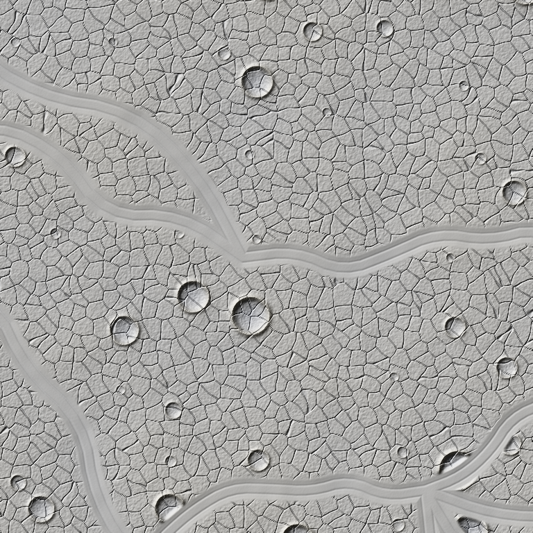
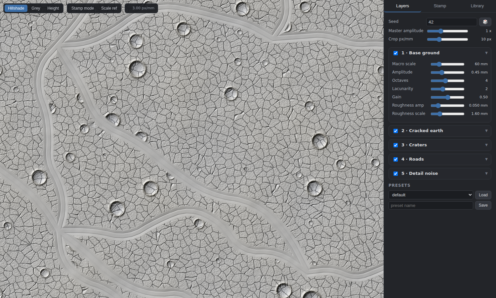
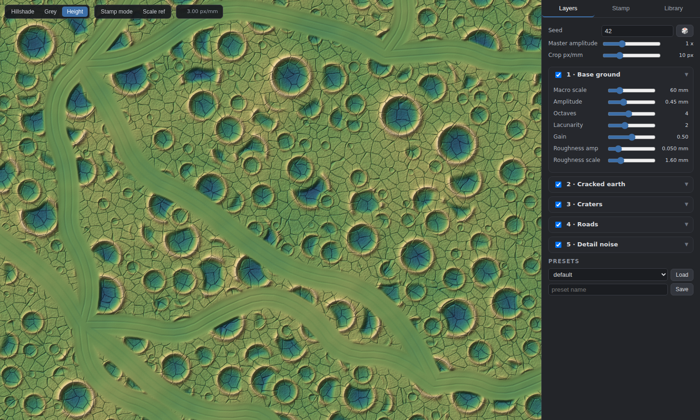
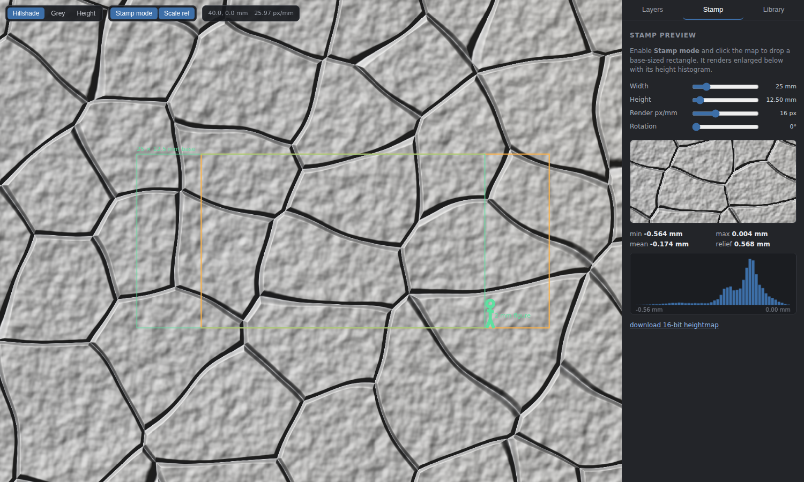
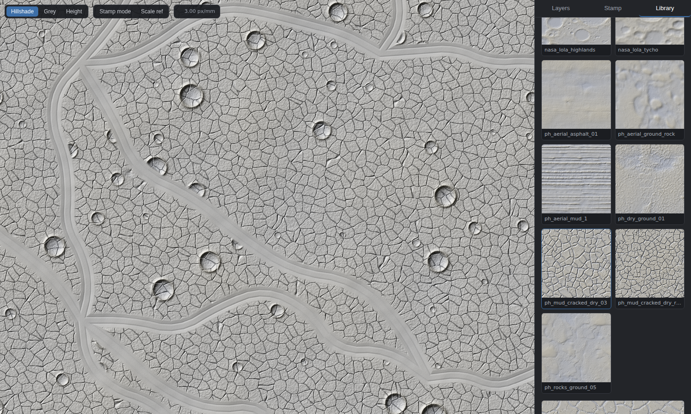
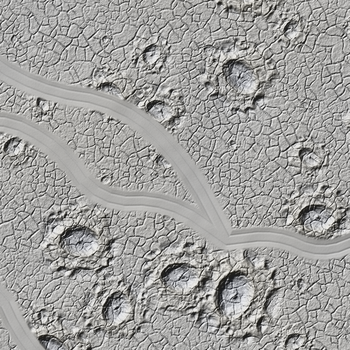
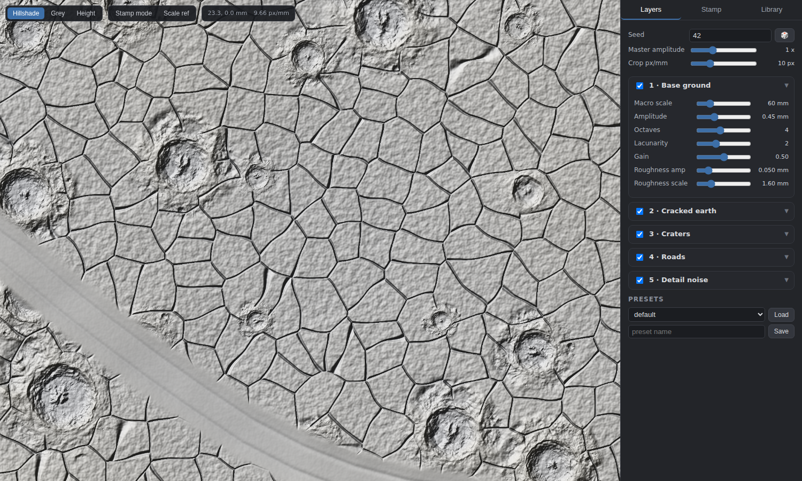
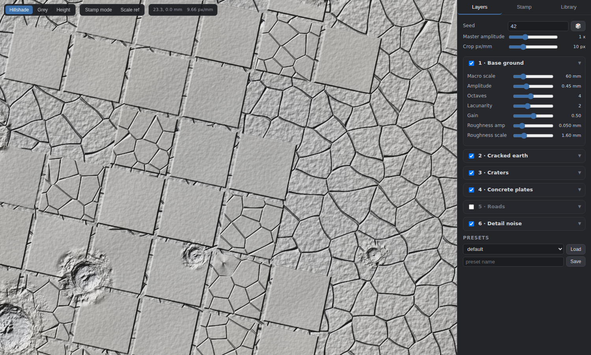
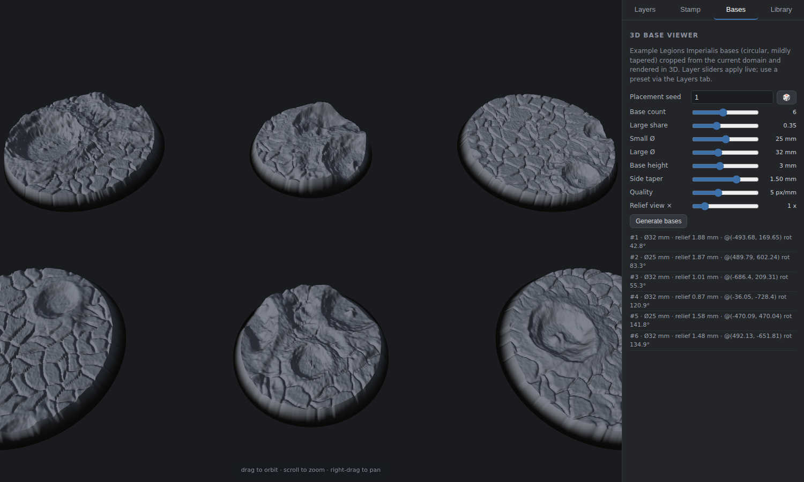

# Battlefield Heightmap Studio

Procedural battlefield heightmap authoring for Legions Imperialis (8mm)
resin-printed bases. One large, continuous, **seeded and deterministic**
terrain domain; an interactive web viewer for tuning it; and a CC0
bump-map library for sourced texture data. The later STL pipeline imports
`battlefield` directly and calls `domain.crop()` — no viewer code involved.

All spatial parameters are **millimeters**; heights are mm of physical
relief (defaults target ~0.3–0.8 mm on a 25 mm base next to 2 mm infantry).

## Setup & run

```bash
python3 -m venv .venv
.venv/bin/pip install numpy scipy pillow fastapi "uvicorn[standard]" pytest
.venv/bin/uvicorn server.app:app --host 0.0.0.0 --port 8000
# open http://<vm>:8000/
```

CLI test render (no server needed):

```bash
.venv/bin/python -m battlefield.cli --seed 42 --w 256 --h 256 --ppm 3 -o test.png
.venv/bin/python -m battlefield.cli --preset presets/sourced_battlefield.json -o test.png
```

Tests:

```bash
.venv/bin/python -m pytest tests/
```

Populate the bump-map library (downloads CC0 / public-domain sources,
writes provenance metadata):

```bash
.venv/bin/python scripts/source_maps.py
```

## Generator API (what the STL pipeline uses)

```python
from battlefield import Domain, Library, load_preset

config, seed = load_preset("presets/sourced_battlefield.json")
dom = Domain(config, seed, library=Library("library"))

# any region on demand — the domain is unbounded, nothing is precomputed
h = dom.render_region(x=0, y=0, w_mm=512, h_mm=512, px_per_mm=4)

# a base crop: (x, y) = crop CENTER, rotation in degrees, mm heights out
crop = dom.crop(x=120.0, y=-45.0, w_mm=25.0, h_mm=12.5,
                rotation=33.7, px_per_mm=10)
```

Guarantees (all covered by `tests/test_generator.py`):

- **Deterministic**: same seed + config + coordinates → bit-identical arrays,
  across processes and sessions. Every layer is a pure function of world
  coordinates and hashed integer lattices — there is no RNG state.
- **Seamless**: adjacent regions/tiles are bit-exact sub-windows of any
  larger render (feature spawning never depends on the query window).
- **Exact rotation**: `crop()` evaluates the field at rotated sample
  coordinates directly — no resampling. 90° crops equal `np.rot90` of the
  unrotated crop.

Config is a plain JSON dict (see `battlefield/config.py` for the full
schema + defaults); presets on disk are `{"seed": ..., "config": ...}`.

## Layers

1. **Base ground** — fBm macro undulation + fine roughness.
2. **Cracked earth** — domain-warped Worley cell edges carved as negative
   displacement (cell size / width / depth / falloff), *or* a sourced
   cracked-earth map tiled with variation (mirror tiling + rotated second
   sample blended by low-frequency noise). Blend: add / min.
3. **Craters** — seeded spawn cells; by default each crater stamps a real
   lunar DEM from a **pool** (Tycho, Copernicus, Theophilus, King,
   Aristarchus, Bürg — NASA LOLA LDEM_64, 473 m/px, extracted by
   `scripts/source_lunar_craters.py` via HTTP range requests, longitude
   stretch corrected). Bowl depth and rim height scale independently
   (real lunar rim/depth ratios read too weak at miniature scale). Impacts
   wipe the crack layer inside bowl+rim (`crack_clearing`). Analytic
   profile (parabolic bowl, gaussian rim, exponential ejecta) available
   via `source_mix`/`source: null`. Newer craters locally carve older ones.
4. **Concrete plates** — big slabs on a rotated grid, appearing in
   noise-driven patches (whole tiles in/out): expansion joints where the
   earth shows through, per-tile lift/tilt (subsided slabs), broken tiles
   with crack networks, missing tiles, and craters shatter the paving
   inside their footprint. Fully vectorized, no feature loops.
5. **Roads** — node grid + probabilistic edges/junctions, midpoint-displaced
   and Chaikin-smoothed splines; corridor flattens terrain toward the macro
   surface with a slight negative offset, optional berms, wheel ruts and
   cracked surface show-through. **Off by default** (see
   `presets/roads_instead_of_plates.json`).
6. **Detail noise** — final high-frequency layer (suppressed on roads and
   damped on plates).

## Web viewer

- Infinite pan/zoom over slippy tiles (256 px, zoom 0–12; at zoom *z* a tile
  covers 4096/2^z mm). Tiles cached on (config hash, mode, z, x, y);
  hillshade is computed with a 2 px apron so lighting seams never show.
- **Hillshade / Grey / Height** (false-color) shading toggle.
- Sliders for every layer parameter + seed, master amplitude, crop px/mm;
  changes re-render visible tiles live (debounced ~300 ms).
- **Stamp preview**: toggle *Stamp mode*, click the map → enlarged crop of a
  base-sized rectangle (mm dimensions + rotation) with height histogram,
  min/max/mean/relief stats, and a 16-bit heightmap download.
- **Scale ref**: overlay of a 25 × 12.5 mm base outline + 2 mm figure.
- **Presets**: save/load JSON on disk (`presets/`).
- **Bases tab (3D)**: renders example Legions Imperialis bases — circular,
  mildly tapered frustums in two sizes (default Ø25/Ø32 mm) — cropped from
  the current domain at seeded positions/rotations and displayed in an
  orbitable three.js view (vendored locally, no CDN). Controls: count,
  size mix, base height, side taper, quality, relief-view exaggeration,
  placement seed. Layer sliders and presets apply live. Backed by
  `POST /api/bases`, which returns the raw crop grids the STL pipeline
  would consume. Also:
  - **Edge lip** — the bump map fades to zero over the last N mm before
    the rim, so the outer edge stays a crisp flat circle regardless of
    the terrain.
  - **Pin sockets (subtracted)** — N≥2 flat-floored holes on an
    equidistant polar ring: configurable Ø, depth, ring radius, plus a
    position-noise dial (0 = perfect, 1 = up to 1 mm XY error per pin,
    seeded/deterministic).
  - **Print support** — optional thin plate under each base (bases print
    horizontal, support extends down): full base width at the top curving
    to a single straight line; configurable height, thickness, bottom
    length.
  - **Base configs** — save/load the whole setup (base options, pins,
    support, placement seed) with the terrain preset embedded, to
    `presets/bases/*.json`.
  - **Export STL** — all displayed bases (+ supports) as one binary STL:
    mm units, Z-up, watertight shells, relief at true 1× regardless of
    the view exaggeration.
- **Library tab**: hillshaded thumbnails of every library entry with full
  provenance; assign any entry to the cracks layer or as crater stamps.

## Bump-map library

`library/<entry>/height.png` (16-bit, normalized 0..1) +
`metadata.json` (source URL, file URL, license, author, tags, original
resolution, physical scale where reported, and the exact normalization
steps applied). Import normalization: greyscale → optional downscale →
slope strip (gaussian high-pass for texture tiles, best-fit plane for DEM
patches) → percentile remap to full range.

Starter set (13 entries, sourced by `scripts/source_maps.py`):

| entries | source | license |
|---|---|---|
| cracked mud ×3, tire-rut mud, rocky ground ×2, cracked asphalt | Poly Haven | CC0 1.0 |
| fine gravel, damaged asphalt, dry eroded dirt | ambientCG | CC0 1.0 |
| Tycho, Copernicus, farside highlands field (LOLA LDEM_16 DEM patches) | NASA LRO LOLA / PDS | public domain |

Only CC0 / public-domain sources are in the manifest; anything with an
unclear license is skipped by policy.

## Milestones

| # | milestone | screenshot |
|---|---|---|
| 1 | generator + CLI render |  |
| 2 | tile server + pan/zoom viewer |  |
| 3 | sliders wired, false-color mode |  |
| 4 | stamp preview + scale ref |  |
| 5 | library browser |  |
| 6 | sourced cracks + LOLA crater stamps |  |
| 7 | real lunar crater pool (LDEM_64) + crack clearing |  |
| 8 | concrete plates layer (replaces roads by default) |  |
| 9 | 3D base viewer tab (Ø25/Ø32 tapered round bases) |  |

## Performance

256 px tiles render in ~0.05–0.4 s on CPU at typical zooms (z0, the most
zoomed-out level, ~1.2 s on first hit); repeat hits are served from the
LRU cache in <1 ms. Display-only LOD (`lod=True` in `render_region`) skips
sub-pixel craters and fades sub-pixel noise octaves at far zooms; crops
never use LOD and are always exact.
